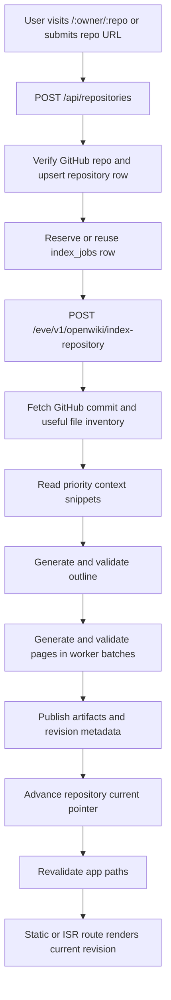
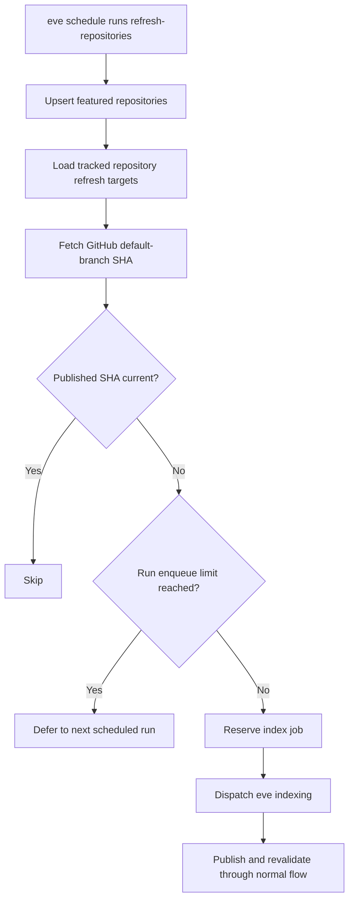
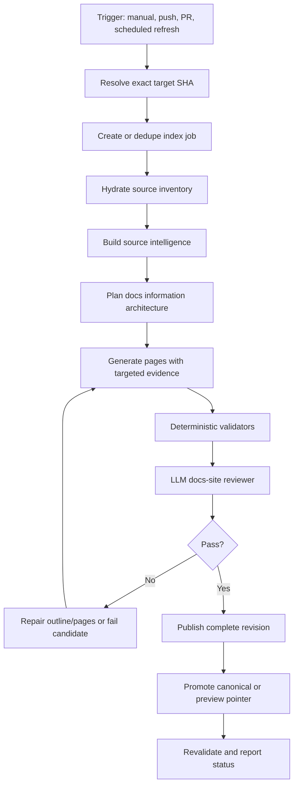

# Wiki Generation And Freshness Plan

## Purpose

OpenWiki should generate repository wikis that feel like real documentation sites and keep them fresh as the source repository changes. This document captures:

- how wiki generation works today
- where the current system is strong
- the limitations that keep output from being consistently docs-site quality
- the target architecture for high-quality generation
- how canonical wikis and pull request preview wikis should stay updated

This is the product and engineering plan for the generation loop. It should stay close to the implementation in `app/`, `agent/`, and `lib/`.

## Product Goal

A generated wiki should help a reader understand a codebase without becoming a shallow file index. The ideal output is a source-grounded docs site:

- a clear sidebar with overview, concepts, guides, API/reference pages, examples, troubleshooting, and contributor/operations material when the source supports it
- pages that explain systems, workflows, public surfaces, commands, options, routes, packages, and examples
- concrete citations back to the indexed commit
- predictable behavior when regeneration fails: keep the last good wiki visible
- automatic freshness for default branches and isolated previews for pull requests

## Current Architecture

OpenWiki is a single Next.js app with an embedded eve agent.

- `app/` owns UI routes, API routes, repository pages, chat pages, and internal revalidation.
- `agent/` owns eve channels, generation orchestration, prompts, validators, and publishing.
- `lib/storage.ts` owns Neon metadata and artifact reads/writes.
- Vercel Blob stores generated markdown, citations, source index artifacts, and file inventory artifacts in hosted environments.
- Local development can use local artifacts for isolated testing.

The current canonical routes are:

- `/:owner/:repo`
- `/:owner/:repo/:slug`
- `/:owner/:repo/chat`

Today the wiki docs routes are static-first App Router routes:

- `/:owner/:repo` is prerendered for featured repositories through `generateStaticParams`
- `/:owner/:repo/:slug` is prerendered for published featured-repository page slugs found in storage during `next build`
- `/:owner/:repo/chat` remains dynamic because it is an interactive chat surface

The remaining target is to make arbitrary, user-generated repositories materialize into ISR/static output after publish, not only curated repositories at deploy time.

The broader target is static-first docs rendering:

- generated wikis for known/featured repositories should be prerendered at build time
- arbitrary repositories should be generated on demand once, then served through ISR/static caching after publish
- every successful publish should call revalidation so the canonical static route updates to the newest revision
- failed generations should never evict the last good static wiki

In other words, generation can happen before build for curated repositories or after first visit for arbitrary repositories, but the published docs experience should behave like a static docs site whenever a revision exists.

## Current Generation Flow

The primary interactive flow is manual or on-demand. A user visits a repository route or submits a GitHub URL; if no wiki exists, OpenWiki starts indexing.



OpenWiki also has a scheduled freshness path for public repositories. A daily eve schedule calls the shared repository refresh service once per day. The service upserts featured repositories, scans tracked repositories, refreshes repository metadata such as description and star count, compares their current published commit SHA to the GitHub default-branch SHA, and queues stale repositories through the same indexing path used by the manual route.

The scheduled path is intentionally cost-limited:

- scan limit defaults to 100 repositories per run
- enqueue limit defaults to 3 stale repositories per run
- repositories are scanned by oldest refresh check first so large tracked sets rotate fairly
- once a stale commit SHA is queued, the refresh loop waits 24 hours before retrying that same SHA
- metadata-only changes are stored without triggering wiki regeneration



### 1. Repository Entry

`POST /api/repositories` is the main browser-facing entry point.

It currently:

- validates the submitted GitHub URL
- checks whether the repository exists
- upserts the repository record
- returns the existing wiki when one is already published unless `force` is set
- detects and fails stale jobs
- reserves a new `index_jobs` row
- calls the embedded eve route `/eve/v1/openwiki/index-repository`

The route is intentionally thin: it owns request validation, repository/job records, and dispatch. It does not do model work.

### 2. Job Reservation And Staleness

`lib/storage.ts` stores one active job pointer on `repositories.active_index_job_id`. This prevents duplicate manual generation for the same repository.

The stale-job logic in `lib/index-job-staleness.ts` handles two cases:

- pre-session jobs that were reserved but never successfully started
- active jobs that stopped reporting progress

The UI polls `GET /api/index-jobs/:jobId` every two seconds and refreshes the route when the job completes.

### 3. eve Channel Dispatch

`agent/channels/internal/index-repository.ts` exposes the internal eve route.

It:

- authenticates local development or Vercel OIDC requests
- validates `indexJobId`, `repositoryId`, `repoUrl`, and optional `webUrl`
- starts `runIndexRepositoryJob`
- uses `waitUntil` so the HTTP request can return quickly while generation continues
- records a failed job if startup fails

This lets the app and agent ship together while keeping generation behind internal server-authenticated routes.

### 4. GitHub Snapshot

`agent/lib/github-repo.ts` resolves the repository's default branch commit, fetches the recursive Git tree, filters to useful source paths, and builds a source inventory.

Current inventory limits:

- up to 25,000 useful files
- each seeded file must be no larger than 512 KB
- skipped files are recorded with a reason

The inventory tracks:

- path
- detected language
- size
- blob SHA/hash

The important detail: the generated wiki is tied to a specific `commitSha`, and the file inventory becomes the source boundary for validation and publishing.

### 5. Context Selection

`agent/lib/indexing/context.ts` selects up to 100 priority files and reads the first 8,000 characters from each.

Priority paths include:

- README and package metadata
- workspace and build config
- docs/content directories
- examples, cookbook, templates
- package/crate manifests
- public entrypoints such as `index`, `main`, `mod`, and `lib`
- selected tests and CI hints
- `src/` paths with scoring that favors entrypoints over fixtures or generated/vendor paths

This context is used for outline generation. Page workers later receive targeted context from the outline page source paths plus baseline snippets.

### 6. Outline Generation

`agent/lib/indexing/run-index-job.ts` calls a structured outline worker using `generateText` with `Output.object`.

The outline output includes:

- title
- summary
- concepts
- navigation
- pages with slug, title, purpose, priority, and source paths

The outline prompt asks for reader-facing documentation structure rather than a file list. It favors:

- overview and getting started
- concepts and architecture
- guides and workflows
- API/reference/configuration pages
- examples, migration, troubleshooting
- contributor/operations pages when source supports them

Current deterministic outline validation checks:

- minimum page count based on repository size and docs-source count
- maximum page count based on repository size
- unique normalized slugs
- repository-level `overview` page
- no folder navigation nodes with both `slug` and children
- source paths are filtered to known inventory paths
- docs-rich repositories need a docs-site spine
- large repositories need reader-journey coverage
- large outlines cannot be dominated by implementation catalog pages

The outline worker gets up to three attempts. Later attempts include validator feedback.

### 7. Page Generation

Page generation runs in batches. The default concurrency is 4 page workers.

Each worker receives:

- the complete outline page list
- one requested page
- repository metadata and commit SHA
- repository map summary
- page-specific context snippets
- quality feedback from prior attempts when repairs are needed

The page schema includes:

- slug
- title
- `markdownLines`
- structured citations
- coverage notes
- related pages

Current deterministic page validation checks:

- page starts with a single `#` title
- at least three `##` sections
- minimum word count based on repository size
- a `## Relevant Source Files` section
- visible `Sources:` lines in prose
- at least one structured citation
- reference-like pages include API/config/command detail
- guide-like pages include concrete commands, examples, workflows, or config when evidence supports them
- important source paths from the outline are mentioned in the page

Each page can attempt generation up to three times. If any page fails, the whole job fails. This is intentional: OpenWiki should not publish partial wikis.

### 8. Publish

`agent/lib/indexing/publish.ts` validates final output and calls `publishWikiRevision` in `lib/storage.ts`.

Publishing writes:

- `repo_revisions`
- `source_files`
- file inventory artifact
- source index artifact
- one markdown artifact per page
- one citations artifact per page
- `wiki_pages`
- `wiki_page_revisions`
- `citations`

The important publish invariant:

1. Write artifacts and revision metadata.
2. Write page revisions.
3. Update page current pointers.
4. Advance `repositories.current_indexed_revision_id`.
5. Mark the index job completed.

If generation fails before this point, the old `current_indexed_revision_id` remains visible.

### 9. Render

`app/repos/[owner]/[repo]/repository-wiki-page.tsx` reads the current wiki through `getRepositoryWiki`.

Rendering uses:

- current repository metadata
- current repo revision
- source index artifact for navigation
- markdown artifact for the current page
- citations artifact for structured page citations
- page summaries for the sidebar

If no wiki exists, the route renders the centered generation state and starts indexing from the client with `RepositoryAutoIndex`.

## Current Strengths

- The system is source-grounded around a concrete commit SHA.
- The publish path is revisioned and artifact-backed.
- Previous good wikis stay visible when a new generation fails.
- The current validators prevent many bad outputs: empty pages, missing citations, shallow outlines, duplicate slugs, malformed navigation, and stub-like pages.
- The UI has a clear generation state and polling loop.
- Index jobs are deduped enough for manual/on-demand use.
- eve internal routes now rely on local dev auth and Vercel OIDC instead of a custom deploy-time secret.

## Current Limitations

### Generation Quality

The quality gates are structural, not deeply semantic. A page can pass because it has enough sections, words, source lines, and citations, while still being less useful than a first-party docs page.

Missing quality checks:

- citations are not verified against exact line ranges or semantic support
- page coverage is not scored against important public surfaces
- public APIs, commands, config keys, routes, examples, and package exports are not extracted deterministically before generation
- there is no reviewer pass that reads the complete wiki as a docs site
- generated pages do not preserve or compare against prior revisions to avoid regressions

### Source Selection

The context selector is path-score based. That is useful, but coarse.

Limitations:

- no repository classifier yet
- no AST/symbol graph for TypeScript, Rust, Python, Go, etc.
- no import/dependency graph
- no docs-site parser for navigation config, frontmatter, or sidebar metadata
- no semantic retrieval index over all files
- large repositories may still miss critical subsystems if priority paths do not expose them

### Update Freshness

Today freshness is mostly scheduled:

- first visit starts generation when no wiki exists
- reindex button can force regeneration
- a daily eve schedule polls tracked public repositories for default-branch changes
- the refresh service queues stale repositories through the existing index job path
- the enqueue limit prevents one scheduled run from starting too many large generations at once

Current gaps:

- there is no GitHub webhook ingestion
- there is no GitHub App installation flow
- public repositories update on the schedule cadence rather than instantly on push
- there are no PR preview wikis
- there is no target SHA input to index a specific commit
- scheduled refresh compares against an exact SHA, but the current indexer still resolves the default branch again when the job runs

The current `getGitHubRepoSnapshot` resolves the current default branch. That is fine for manual refresh, but webhook and PR flows need exact commit indexing.

### Durability And Observability

The current generation path uses `waitUntil` plus job rows. That works for the manual product loop, but webhook-triggered updates need stronger orchestration.

Current gaps:

- no durable workflow wrapper for retries and long-running orchestration
- no persisted prompt/input trace for outline and page workers
- no compact run summary artifact
- no cost/token/latency reporting per job and per page
- no job event table separate from logs
- no GitHub feedback surface for update status

### Publishing And Revalidation

Publishing is atomic enough for canonical manual wikis, but not yet designed for multiple publication modes.

Missing modes:

- canonical default-branch revision
- PR preview revision
- branch preview revision
- staged candidate revision before promotion
- incremental revision assembled from reused pages plus regenerated pages

### Static Rendering

The wiki route tree is now configured for static-first docs rendering.

Implemented:

- wiki docs routes export `dynamic = "force-static"`
- the root layout no longer reads `cookies()` on the server; it renders a static dark default and uses the inline theme bootstrap script before hydration
- `/:owner/:repo` uses `generateStaticParams` from the featured repository registry
- `/:owner/:repo/:slug` uses `generateStaticParams` from published wiki pages in storage for featured repositories
- `/:owner/:repo/chat` remains `force-dynamic`

Remaining gap:

- arbitrary generated repositories do not yet have a fully verified ISR materialization path after publish

The inline theme script can still prevent dark-mode flashes without requiring a server-side cookie read. Static wiki routes should avoid request-time APIs and let revalidation update the cached docs pages after a new revision publishes.

## Target Generation Architecture

The target system should keep the current deterministic backbone, but add richer source understanding, generation traces, review passes, and multiple publish modes.



### Static Docs Rendering Model

OpenWiki should treat published wiki revisions as static docs content, not as request-time application state.

For curated repositories:

- maintain a registry of known repositories to feature and prebuild
- generate or refresh their wiki revisions before deployment, either manually, through a scheduled job, or through a build-triggering workflow
- use `generateStaticParams` for the known `/:owner/:repo` and `/:owner/:repo/:slug` paths
- read the already-published revision during `next build`
- deploy those pages as prerendered static output

For arbitrary repositories:

- allow first visit to return an empty/generating state
- run the normal indexing job
- publish a revision atomically
- call `revalidatePath` for the repository root and each page slug
- let the next request materialize and cache the static route through ISR

This gives both behaviors we want:

- featured wikis are real static pages at deploy time
- user-created wikis become static after their first successful generation

The chat route can remain dynamic because it is an interactive application surface. The wiki/docs routes should be static-first.

Important implementation details:

- keep wiki docs routes free of request-only APIs such as `cookies()` and `headers()`
- keep theme prehydration in the root layout without server-side cookie reads
- keep `generateStaticParams` connected to the featured repository registry and published page slugs
- wrap or constrain future wiki data reads so Next can continue to prerender safely
- revalidate all canonical paths after publish
- keep current revision pointers atomic so prerender never observes a partially published wiki

### Source Intelligence Layer

Before asking a model to write docs, OpenWiki should build a deterministic source intelligence bundle.

Inputs:

- Git tree at exact commit
- README/docs files
- package/crate/app manifests
- source entrypoints
- examples
- tests
- CI/build/deploy config

Derived signals:

- repository type: library, framework, app, CLI, monorepo, docs-rich project, systems repo
- package/crate/workspace map
- public exports and entrypoints
- CLI commands and options
- route handlers and API endpoints
- config files and known keys
- examples and sample apps
- test suites and fixtures
- docs navigation/frontmatter/sidebar structure
- import/dependency graph at folder/package level
- changed-file graph for incremental updates

This does not replace model reasoning. It gives the model accurate scaffolding and gives validators objective expectations.

### Outline Planner

The outline should become a two-step process:

1. deterministic candidate IA from source intelligence
2. model outline planner that chooses a docs-site structure

The outline output should include:

- navigation tree
- pages
- audience and repository type
- source dependencies per page
- page kind: overview, concept, guide, reference, example, troubleshooting, contributor, operations
- required deterministic coverage expectations

The planner should not invent docs areas unsupported by source, but it should also avoid mirroring folders unless folders are the actual product boundary.

### Page Writer

Page generation should stay page-scoped, but each page should receive a richer evidence packet:

- page spec
- selected snippets
- deterministic symbols/exports/routes/config examples relevant to that page
- existing first-party docs excerpts when present
- related pages and glossary terms
- prior wiki page content when regenerating
- changed files when incremental

The page output should include:

- markdown
- structured citations
- source dependencies
- coverage notes
- extracted reference items used
- confidence and known gaps

### Reviewer

After all pages pass deterministic validation, run a bounded reviewer pass over the whole wiki.

Reviewer input:

- outline
- page markdown summaries or complete pages when small enough
- citations
- source intelligence summary
- repository type
- quality rubric

Reviewer output:

- pass/fail
- severity
- page-specific repair requests
- missing coverage areas
- unsupported or weakly supported claims

Only publish if deterministic validation and reviewer pass both succeed. If reviewer failures are repairable, regenerate only the failing pages or outline slice.

## Quality Rubric

Generated wikis should be scored on:

- **Coverage:** important public surfaces, architecture, workflows, examples, tests, and operations are represented.
- **Specificity:** pages name real files, functions, packages, commands, options, routes, config keys, or examples.
- **Grounding:** concrete claims have visible source paths and structured citations.
- **Accuracy:** cited paths exist at the indexed commit, and line ranges support nearby claims.
- **Structure:** navigation reads like documentation, not filesystem inventory.
- **Depth:** pages explain why and how systems work, not only where files live.
- **Reader Utility:** a new user or contributor can answer practical questions from the wiki.
- **Freshness:** the wiki records source commit and update trigger, and stale revisions are detectable.

## Keeping Wikis Updated

OpenWiki needs two freshness products:

- canonical default-branch wiki updates
- pull request preview wikis

### Default-Branch Updates

Default-branch updates should advance the public wiki.

Flow:

1. Install a GitHub App for the repository.
2. Receive `push` events in `POST /api/github/webhook`.
3. Verify the GitHub signature from the raw request body.
4. Resolve the repository connection.
5. Ignore non-default-branch refs.
6. Compare event `after` SHA to `repositories.current_indexed_revision_id -> repo_revisions.commit_sha`.
7. Deduplicate jobs by repository and target SHA.
8. Start indexing for the exact SHA.
9. Publish a new canonical revision only after quality gates pass.
10. Advance `repositories.current_indexed_revision_id`.
11. Revalidate the repo root and page routes.
12. Optionally update a GitHub status or check.

MVP should full-regenerate on each accepted default-branch update. Incremental regeneration should come after exact-SHA indexing and dependency tracking are solid.

### Pull Request Preview Wikis

PR previews should never overwrite canonical docs.

Flow:

1. Receive `pull_request` opened, reopened, synchronize, and ready-for-review events.
2. Verify signature and dedupe delivery.
3. Resolve repository connection and installation token.
4. Create or update a preview record keyed by repository, PR number, and head SHA.
5. Start indexing for the PR head SHA.
6. Publish into a preview pointer, not `repositories.current_indexed_revision_id`.
7. Expose a route such as `/:owner/:repo/pull/:number` or `/previews/:previewId`.
8. Create/update a GitHub Check Run named `OpenWiki preview`.
9. Mark previews inactive when PRs close.

If a PR merges, the default-branch push updates the canonical wiki.

### Scheduled Refresh

Scheduled refresh is the current freshness mechanism for public repositories and will remain the backstop after webhooks exist.

- an eve schedule runs `agent/schedules/refresh-repositories.ts` daily
- the shared refresh service ensures featured repositories exist in storage
- it lists tracked repositories by oldest refresh check
- it compares current default branch SHA to current indexed SHA
- it enqueues stale repositories, up to the per-run limit
- it avoids retrying the same stale SHA until the retry cooldown has elapsed
- optionally run a periodic full regeneration for high-value repos even when diffs are small

This gives us eventual freshness even when GitHub delivery or webhook setup fails.

## Incremental Update Strategy

Full regeneration is the correct first version. Incremental updates should be introduced after the system can index exact SHAs and persist page dependencies.

Required data:

- page source dependencies from outline `sourcePaths`
- citations
- visible `Sources:` paths
- deterministic symbols/reference items used by each page
- prior page content and page kind
- changed files between old commit and new commit

Dirty-page selection:

1. Compute changed files.
2. Mark pages dirty when changed files intersect page dependencies.
3. Expand dirty set for shared package manifests, workspace config, docs nav, public entrypoints, and deleted files.
4. Mark overview and navigation-sensitive pages dirty for broad structural changes.
5. Force full outline regeneration when package/crate layout, docs IA, public API, or route structure changes.
6. Reuse unchanged pages only when their dependencies are unchanged and their citations still exist.
7. Assemble a complete new revision from reused and regenerated pages.
8. Publish atomically.

Full regeneration triggers:

- first wiki for a repository
- large diff size
- many package/entrypoint changes
- docs navigation restructure
- deletion of cited files
- model reviewer says reused pages are stale
- scheduled quality refresh

## Storage And Schema Additions

Current schema is enough for manual canonical generation. Freshness needs explicit trigger and preview state.

Suggested additions:

- `github_installations`
  - installation id, account login, permissions snapshot
- `repository_connections`
  - repository id, GitHub repository id, installation id, default branch, auto-update mode
- `webhook_deliveries`
  - delivery id, event name, repository id, status, error, received timestamp
- `index_jobs` additions
  - trigger type: manual, push, pull request, scheduled
  - trigger id
  - target ref
  - target SHA
  - pull request number
  - publish mode: canonical or preview
- `repo_previews`
  - repository id, PR number, head SHA, base SHA, status, current preview revision id
- `repo_revision_page_dependencies`
  - repo revision id, page revision id, source path, dependency kind
- `index_job_events`
  - job id, phase, event payload, created timestamp
- `generation_traces`
  - job id, worker type, prompt artifact id, output artifact id, validation failures, attempt number
- `quality_reports`
  - repo revision id, deterministic scores, reviewer result, coverage summary

## Webhook And Workflow Plan

Webhook route:

```text
POST /api/github/webhook
```

Responsibilities:

- read raw body
- verify `X-Hub-Signature-256`
- dedupe `X-GitHub-Delivery`
- parse supported events
- create/dedupe index jobs
- acknowledge quickly
- start a durable workflow or dispatch a background job

Do not run model work in the webhook route.

Durable workflow responsibilities:

- resolve installation token
- create or dedupe job
- dispatch eve indexing
- monitor completion
- update GitHub checks
- retry transient failures
- mark fatal failures clearly

eve should continue owning source-grounded generation. Workflow should own event orchestration, retries, and external feedback.

## Proposed Implementation Phases

### Phase 1: Static-First Wiki Routes

- Done: remove `force-dynamic` from wiki docs routes.
- Done: remove server-side `cookies()` from the wiki-rendering path so routes can prerender.
- Done: keep the inline theme bootstrap script for prehydration and dark-mode flash prevention.
- Done: make wiki reads static-safe for prerendered featured paths.
- Done: add `generateStaticParams` for featured repositories and their published page slugs.
- Keep arbitrary repository fallback behavior so unknown repos can generate on first visit.
- Revalidate repository root and page slug paths after publish.
- Done: verify Next build output marks featured wiki pages as prerendered SSG.

### Phase 2: Exact-SHA Manual Indexing

- Add `targetSha` and `targetRef` to `/api/repositories` and `/eve/v1/openwiki/index-repository`.
- Make `getGitHubRepoSnapshot` index the exact target SHA when supplied.
- Store trigger metadata on `index_jobs`.
- Dedupe manual reruns for the same repository and commit.
- Show indexed commit in the UI.

### Phase 3: Generation Traceability

- Persist outline/page worker prompt inputs and structured outputs as private artifacts.
- Store validation issues and repair attempts.
- Add a compact job trace view or CLI summary.
- Report page count, word count, citation count, source coverage, duration, and model attempts.

### Phase 4: Source Intelligence

- Add repository classifier.
- Extract package/crate/app map.
- Parse public exports, CLI bins, config files, route handlers, docs frontmatter, examples, and test signals.
- Feed source intelligence into outline and page prompts.
- Add validators that compare output coverage against source intelligence.

### Phase 5: Reviewer Pass

- Add a whole-wiki reviewer after page generation.
- Fail or repair weak pages before publish.
- Persist reviewer reports.
- Add a small golden repo eval set and compare quality over time.

### Phase 6: Default-Branch Webhooks

- Add GitHub App installation and webhook route.
- Verify signatures and store deliveries.
- Support default-branch push events.
- Full-regenerate canonical wiki for exact target SHA.
- Add dedupe and per-repo concurrency.

### Phase 7: Pull Request Previews

- Add preview publish mode.
- Add preview routes.
- Support pull request events.
- Add GitHub Check Run feedback.
- Expire preview artifacts after close.

### Phase 8: Incremental Updates

- Persist page dependencies.
- Compute changed files between revisions.
- Regenerate dirty pages and reuse clean pages.
- Force full outline regeneration when repository shape changes.
- Periodically full-regenerate to prevent drift.

## Open Questions

- Should auto-update be immediate on every push or debounced for a few minutes?
- Should PR previews be opt-in per repository to control generation cost?
- Should private repository support live in separate, authenticated deployments with explicit token scoping?
- How long should preview artifacts live after PR close?
- What is the minimum reviewer score for auto-publish?
- Should canonical updates ever require human approval when the generated diff is large?
- Should wikis include a generated changelog between source commits?
- Should OpenWiki render generated docs as immutable revision URLs in addition to the current pointer?

## Near-Term Recommendation

The next high-leverage work is:

1. arbitrary-repository ISR materialization after first successful publish
2. exact-SHA indexing
3. generation trace artifacts
4. source intelligence for public surfaces and docs IA
5. reviewer pass before publish
6. default-branch webhook ingestion

Static-first featured wiki routes now make the product feel more like a real generated docs site at deploy time. The next sequence improves on-demand static materialization, quality, and debuggability before adding fully automatic updates. Once generation is traceable and exact-commit based, default-branch and PR freshness become much safer to ship.
